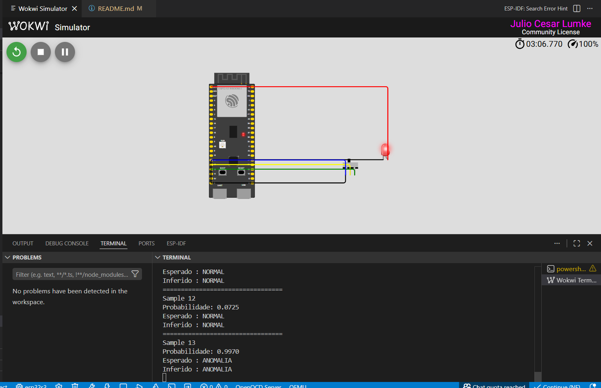

# ⚙️ Detection of Acoustic Anomalies with TinyML on ESP32-S3

Sistema embarcado de detecção de anomalias acústicas utilizando **TensorFlow Lite Micro**, **ESP32-S3** e técnicas de **TinyML** para inferência em tempo real.

O projeto executa um modelo de Machine Learning embarcado capaz de identificar padrões acústicos anormais a partir de features extraídas de sinais de vibração/áudio industrial.

---

# 📸 Simulação no Wokwi

```text
simulation.png
```

O README exibirá automaticamente a imagem abaixo:



---

# 🎯 Objetivo do Projeto

Este projeto demonstra a implementação de um pipeline completo de IA embarcada:

- Pré-processamento de sinais
- Extração de features acústicas
- Inferência TinyML em microcontrolador
- Classificação de anomalias em tempo real
- Simulação no Wokwi
- Compatibilidade com hardware físico ESP32-S3

O sistema foi projetado para aplicações de:

- Manutenção preditiva
- Monitoramento industrial
- Detecção de falhas mecânicas
- Análise de vibração
- Edge AI / TinyML

---

# 🧠 Arquitetura do Modelo

O modelo embarcado utiliza:

- Regressão logística
- TensorFlow Lite Micro
- Inferência FLOAT32
- 5 features acústicas

## Features utilizadas

| Feature | Descrição |
|---|---|
| RMS | Energia média do sinal |
| Peak | Pico máximo |
| Kurtosis | Detecção de impulsos |
| Skewness | Assimetria estatística |
| Crest Factor | Relação pico/RMS |

---

# 🔬 Pipeline de Processamento

## 1. Captura do sinal

O sistema recebe frames de áudio/vibração contendo:

- ruído normal
- transientes
- impulsos mecânicos
- assinaturas acústicas

---

## 2. Pré-processamento HHT + UKF

O pipeline aplica:

- EMA (Exponential Moving Average)
- HHT-inspired filtering
- suavização adaptativa tipo UKF

Objetivos:

- remover drift
- reduzir ruído
- preservar transientes de falha

---

## 3. Extração de Features

As features estatísticas são calculadas para cada frame de áudio.

---

## 4. Inferência TinyML

As 5 features são enviadas ao modelo `.tflite` embarcado no ESP32-S3.

Saída:

```text
Probabilidade de anomalia
```

Classificação:

- `NORMAL`
- `ANOMALIA`

---

# 📦 Estrutura do Projeto

```text
detection_of_acoustic_anomalies/
│
├── main/
│   ├── main_functions.cc
│   ├── model_data.cc
│   ├── model.h
│   ├── test_data.h
│   ├── constants.h
│   └── output_handler.cc
│
├── build/
│
├── simulation.png
│
├── README.md
│
└── CMakeLists.txt
```

---

# 🧪 Simulação Atual

A versão atual executa:

- inferência embarcada
- validação de amostras do dataset
- classificação em tempo real
- testes diretamente no terminal do ESP-IDF/Wokwi

Exemplo de saída:

```text
=================================
Sample 0

Probabilidade: 0.9981

Esperado : ANOMALIA
Inferido : ANOMALIA
```

---

# 🛠️ Tecnologias Utilizadas

| Tecnologia | Uso |
|---|---|
| ESP-IDF | Framework embarcado |
| ESP32-S3 | Microcontrolador |
| TensorFlow Lite Micro | Inferência TinyML |
| Wokwi | Simulação |
| Python | Treinamento e geração do dataset |
| NumPy | Processamento numérico |
| Matplotlib | Visualização |
| TinyML | IA embarcada |

---

# 🚀 Como Compilar

## 1. Clonar o projeto

```bash
git clone <repositorio>
```

---

## 2. Entrar na pasta

```bash
cd detection_of_acoustic_anomalies
```

---

## 3. Compilar

```bash
idf.py build
```

---

## 4. Executar no ESP32-S3

```bash
idf.py flash monitor
```

---

# 📊 Dataset Utilizado

O projeto utiliza dados alinhados com distribuições estatísticas inspiradas em:

- DCASE Task 2
- MIMII Dataset
- sinais industriais sintéticos calibrados

As amostras incluem:

- condições normais
- falhas impulsivas
- assinaturas de rolamentos
- eventos transientes

---

# 🔮 Próximos Passos

- Integração com microfone I2S real
- Captura acústica em tempo real
- Deploy físico em ESP32-S3
- Streaming serial de features
- Dashboard de monitoramento
- Detecção online contínua

---

# 👨‍💻 Autores

Projeto desenvolvido para estudos de:

- TinyML
- Edge AI
- Sistemas embarcados inteligentes
- Detecção de anomalias acústicas

---

# 📜 Licença

Projeto acadêmico e educacional.